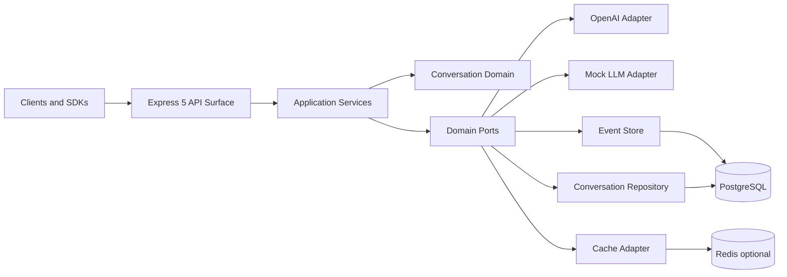

# Lime Standalone AI Chat Backend Design

## Executive Summary

Lime is a new standalone backend project extracted from proven MicroPhoenix patterns and reduced to the smallest architecture that still meets production-grade expectations for an AI chat API. The design goal is not to copy the full MicroPhoenix platform, but to preserve its strongest primitives:

- explicit dependency injection
- domain ports with infrastructure adapters
- typed configuration and DTO validation
- append-only domain events
- request-scoped correlation context
- graceful shutdown
- observable, testable, open-source-ready delivery

The northbound API target is OpenAI-compatible `POST /v1/chat/completions` with Server-Sent Events streaming. The southbound provider abstraction remains provider-neutral through `ILLMAdapter`, so the system can speak to OpenAI first and later Claude-compatible or local model adapters without changing the application layer.

The design explicitly follows current April 2026 official guidance for Node.js LTS selection, Express 5, TypeScript 6, Vitest 4, OpenAI SDK 6, Docker multi-stage builds, GitHub rulesets, push protection, artifact attestations, OpenSSF Scorecard, and SLSA v1.2.

Companion extraction boundary document:

- `docs/LIME_MICROPHOENIX_EXTRACTION_MATRIX.md`

## Decision Statement

### Chosen Path

Build a fresh standalone repository at `c:\lime` and compose a focused backend from MicroPhoenix patterns plus current external standards.

### Adopt / Extend / Build

- **Adopt** from MicroPhoenix:
  - DI container shape
  - Result monad pattern
  - port/adapter boundaries
  - request context propagation
  - orchestrated bootstrap and shutdown flow
- **Extend** with current standards:
  - TypeScript 6.0 configuration model
  - Express 5 middleware and route semantics
  - Vitest 4 coverage and projects model
  - GitHub supply-chain controls and attestations
- **Build** new for Lime:
  - smaller 4-layer architecture
  - OpenAI-compatible public API
  - dual-mode runtime: zero-dependency dev, Postgres-backed prod
  - minimal conversation domain and event model

### Why This Is The Smallest Sound Plan

Anything smaller than this becomes a demo, not a real backend. Anything much larger recreates MicroPhoenix instead of extracting a reusable product. This design keeps the smallest architecture that still preserves correctness, observability, portability, and publication readiness.

### Extraction Law

Lime preserves MicroPhoenix's strongest engineering invariants, but does not inherit MicroPhoenix's full platform surface area.

In practice this means:

- preserve DI, Result, typed config, bootstrap discipline, request correlation, structured logging, and port/adapter boundaries
- adapt eventing, middleware breadth, token catalogs, and context richness down to MVP size
- defer distributed and platform-level capabilities to post-MVP releases
- exclude MCP, multi-agent control-plane, memory systems, extraction machinery, and domain-specific healthcare surfaces

The exact preserve/adapt/defer/exclude matrix lives in the companion extraction document.

## Source Authority And External Evidence

### Local Authority Surfaces

1. `KNOWN_BUGS.md`
2. `docs/protocols/DOCUMENTATION_GOVERNANCE_SOTA_2026.md`
3. `docs/protocols/GITHUB_PUBLICATION_PROTOCOL_2026.md`
4. `docs/protocols/GITHUB_PUSH_PREPARATION_PROTOCOL_2026_04.md`
5. MicroPhoenix implementation patterns in:
   - `src/core/di/container.ts`
   - `src/core/result.ts`
   - `src/config/index.ts`
   - `src/domain/ai/ILLMAdapter.ts`
   - `src/infrastructure/ai/OpenAIAdapter.ts`
   - `src/application/app.ts`
   - `src/application/controllers/chatController.ts`
   - `src/core/bootstrap/orchestrator.ts`
   - `src/index.ts`

### External Evidence Used

| Source | What it establishes | Design impact |
| --- | --- | --- |
| Node.js Releases | `v24` is Active LTS, `v22` is Maintenance LTS, production should use Active or Maintenance LTS | Target Node 24 as primary runtime |
| Express 5 migration guide | Express 5 requires Node 18+, handles rejected async promises, changes path matching, static dotfile defaults | Use Express 5.2.x and code to v5 semantics |
| Express security guide | Helmet, input distrust, fingerprint reduction, secure cookies, brute-force controls | Security middleware baseline |
| TypeScript docs and TS 6 release notes | TS 6.0.2 is current, `moduleResolution node` deprecated, `baseUrl` deprecated, `types` default now `[]`, `rootDir` defaults changed | Explicit TS 6 config, avoid deprecated options |
| Vitest docs and migration guide | Vitest 4.1.x is current, Node 20+, Vite 6+, improved AST-aware coverage remapping | Use Vitest 4 with explicit coverage include/exclude |
| OpenAI docs | Responses API is recommended for all new projects, Chat Completions still supported, `developer` role, SDK exposes retries, request IDs, streaming, custom logger | Keep external Chat Completions compatibility; provider adapter abstracts future migration |
| npm package pages | exact stable package versions for Express, TypeScript, Vitest, OpenAI SDK | Version baseline table |
| Docker multi-stage docs | named stages, BuildKit-aware builds, stage targeting, artifact copying | Use named multi-stage Dockerfile |
| GitHub docs on push protection, rulesets, artifact attestations | repo hardening, secret scanning, provenance, SLSA alignment | Standard and Production publication tiers |
| SLSA v1.2 Build requirements | provenance, authenticity, hosted builders, isolation | Release-grade CI and provenance target |
| OpenSSF Scorecard checks | branch protection, dangerous workflow, token permissions, SBOM, signed releases, code review | OSS hardening checklist |

## Version Baseline

### Primary Runtime And Core Tooling

| Component | Recommended baseline | Evidence | Reasoning |
| --- | --- | --- | --- |
| Node.js | `24.14.1` | Node official releases page | current Active LTS, longest support runway |
| Express | `5.2.1` | npm package page + Express 5 docs | current stable Express 5 line |
| TypeScript | `6.0.2` | npm package page + TS 6 release notes | current major, modern defaults, future-facing |
| Vitest | `4.1.4` | npm package page + Vitest docs | current major, good ESM/TS fit |
| OpenAI SDK | `6.34.0` | npm package page | current SDK with request IDs, retries, logger support, workload identity |

### Secondary Package Policy

For secondary packages, pin the latest stable major/minor at scaffold time and let Renovate or Dependabot keep patch levels current. The project should not hardcode stale versions into docs unless exact compatibility matters.

Recommended secondary stack:

- `zod` for config and DTO validation
- `pino` and `pino-pretty` for structured logging
- `helmet` for security headers
- `cors` for origin control
- `hpp` for HTTP parameter pollution defense
- `compression` for response compression
- `express-rate-limit` for coarse-grained abuse protection
- `supertest` for HTTP integration tests
- `tsx` for local development execution
- `eslint`, `typescript-eslint`, `eslint-plugin-security` for linting
- `ts-morph` for architecture tests
- `pg` for PostgreSQL in production mode
- `ioredis` for optional Redis cache
- `prom-client` for Prometheus metrics

## Problem Framing

### User-Facing Goal

Provide a backend that can be used like an OpenAI-compatible chat service, but can start instantly in local development without a database, Redis, or model provider credentials.

### Engineering Goal

Create a clean public repository that:

- starts locally with zero external services
- speaks a standard northbound API contract
- upgrades to production mode through configuration only
- is publishable on GitHub without embarrassing architectural debt

### Non-Goals

Lime is **not** trying to become:

- a full MicroPhoenix clone
- an MCP platform
- a multi-agent orchestration system
- a vector retrieval platform
- a frontend application
- a medical or research product

## Architectural Principles

1. **Compatibility at the edge, simplicity at the core.**
2. **Ports in domain, adapters in infrastructure.**
3. **Operationally honest development mode.** In-memory mode is allowed, but must not pretend to be production.
4. **Explicit configuration beats magic defaults.**
5. **No secret knowledge in the runtime.** Everything environment-sensitive comes from config or DI.
6. **Every important path is observable.**
7. **Open-source readiness is part of design, not a later cleanup.**
8. **Extract semantic cores, not platform shells.**

## MicroPhoenix Extraction Boundary

### Preserve In MVP

- DI container kernel
- Result monad
- typed config loader
- bootstrap and graceful shutdown discipline
- request correlation context
- structured logging
- domain ports with infrastructure adapters

### Adapt For MVP

- event-store surface
- Express middleware breadth
- request-context payload size
- token registry size
- publication process depth

### Defer Beyond MVP

- causation chains and global sequence numbers
- CQRS projections
- embeddings and semantic retrieval
- internal HMAC protocols and worker leases
- formal release evidence packet automation

### Exclude From MVP

- MCP server estate
- multi-agent orchestration
- self-learning and memory planes
- extraction machinery
- healthcare-specific modules and workflows

The companion extraction matrix provides the exact rationale and source mapping.

## Verified MicroPhoenix Census

This blueprint is now cross-referenced against the live MicroPhoenix codebase as of `2026-04-14`, not only against earlier design intent.

Verified first-level subsystem counts in `c:\plans\src`:

- Domain subdirectories: `67`
- Infrastructure subdirectories: `77`
- Application subdirectories: `35`
- Core subdirectories: `29`
- Source LOC baseline: `~291,114`
- DI registry scale: `170+` tokens in a `1749`-line `src/core/di/DI_TOKENS.ts`

Representative live-code anchors used during this verification pass:

- `src/domain/ai/ILLMAdapter.ts`
- `src/domain/events/IEventStore.ts`
- `src/domain/events/IEventBus.ts`
- `src/domain/security/tool-execution-policy.interface.ts`
- `src/domain/context/ISemanticPagingService.ts`
- `src/domain/context/IHybridRetrievalService.ts`
- `src/domain/context/IPromptCompressor.ts`
- `src/domain/memory/IWorkingMemory.ts`
- `src/domain/mcp/IMcpBridge.ts`
- `src/domain/a2a/IAgentCardProvider.ts`
- `src/domain/a2a/IA2AAuthorizationGuard.ts`
- `src/domain/swarm/ISwarmOrchestrator.ts`
- `src/domain/platform/IPlatformAdapter.ts`
- `src/domain/security/IConstitutionalGuard.ts`

This matters because Lime's roadmap should activate seams already visible in MicroPhoenix rather than inventing a second architecture lineage.

## Definitive Horizon Architecture

Lime should be understood as a horizon-based extraction from MicroPhoenix rather than a one-shot clone. Each horizon adds ports, adapters, and tokens, but should not rewrite the core primitives established in H0.

### Horizon Summary

| Horizon | Goal | Representative capability families | Approx cumulative DI tokens | Approx cumulative LOC |
| --- | --- | --- | --- | --- |
| `H0` | Chat backend MVP | chat completions, SSE, in-memory state, zero-infra dev mode | `9` | `~4K` |
| `H1` | Multi-provider + persistence | Anthropic/Ollama, PostgreSQL, Redis, JWT | `15` | `~8K` |
| `H2` | Event maturity + RAG | GSN, replay, embeddings, vector retrieval, prompt compression | `25` | `~18K` |
| `H3` | Agents + tools + MCP | tool firewall, MCP bridge, agent runner, sandbox, platform abstraction | `43` | `~40K` |
| `H4` | Memory planes + context engine | working/summary/governance/archival memory, S-MMU, predictive context, graph-backed retrieval | `69` | `~80K` |
| `H5` | Full MicroPhoenix platform | MAS, A2A, swarm, channels, plugins, advanced security, broader governance | `170+` | `~291K` |

### H0: Chat Backend MVP

H0 is the smallest honest Lime.

Functional port set centered across domain and core:

- `ILLMAdapter`
- `IConversationRepository`
- `IEventStore`
- `IEventBus`
- `ICache`
- `IStructuredLogger`

Core surfaces carried from MicroPhoenix in simplified form:

- DI container with circular dependency guard and a dormant scoped-lifecycle seam
- `Result<T>` monad
- namespaced Zod config loader
- request context via `AsyncLocalStorage`
- bootstrap orchestrator
- graceful shutdown guard
- typed app errors

Representative H0 adapters:

- `MockLLMAdapter`
- `OpenAIAdapter`
- `InMemoryConversationRepository`
- `InMemoryEventStore`
- `InMemoryEventBus`
- `InMemoryCache`
- `PinoLogger`
- `AppServer`

Representative H0 application surfaces:

- `ChatService`
- `ChatController`
- `HealthController`
- `ConversationController`
- request-context middleware
- request-logger middleware
- API auth middleware
- error-handler middleware

Required architecture gates at H0:

- domain must not import infrastructure
- every port must have an adapter
- every DI token must resolve
- no `process.env` access outside config loading
- circular dependency detection must stay active

### H1: Multi-Provider + Persistence

H1 raises Lime from a pure in-memory chat backend to a durable backend product.

Representative additions:

- `ILLMAdapterFactory`
- `IAuthProvider`
- `IDatabaseConnection`
- `IMigrationRunner`
- Anthropic and Ollama adapters
- PostgreSQL connection and persistence adapters
- Redis cache adapter
- JWT auth provider

H1 keeps H0's public contract intact while swapping dev-mode adapters for durable production adapters.

### H2: Event Maturity + RAG

H2 activates the first serious retrieval and event-maturity seams already present in MicroPhoenix.

Representative verified families:

- vector store and embedding-related ports
- memory extraction and consolidation ports
- event projection and replay surfaces
- context ports such as `ISemanticPagingService`, `IHybridRetrievalService`, and `IPromptCompressor`

This is the point where event envelopes should activate stronger fields such as causation chains and ordered replay metadata rather than redefining the event primitive.

### H3: Agents + Tools + MCP

H3 is where Lime stops being just a backend and begins to admit agentic control-plane behavior.

Representative verified anchors:

- `src/domain/security/tool-execution-policy.interface.ts`
- `src/domain/mcp/IMcpBridge.ts`
- `src/domain/platform/IPlatformAdapter.ts`

Representative capability families:

- tool registry and tool execution policy
- prompt-injection and output-rail security
- user approval interception for destructive paths
- agent runner and registry
- sandbox execution strategy
- MCP server and bridge ports
- cross-platform adapter requirements

Hard invariants introduced here:

- every tool call must pass the firewall policy
- no `process.platform` usage above Infrastructure
- human approval interception becomes first-class for destructive actions

### H4: Memory Planes + Context Engine

H4 activates MicroPhoenix's deeper memory and context-engineering lineage.

Representative verified anchors:

- `IWorkingMemory`
- `ISemanticPagingService`
- `IHybridRetrievalService`
- `IPromptCompressor`
- `IConstitutionalGuard`

Representative capability families:

- working, summary, governance, and archival memory planes
- memory access policy and integrity
- semantic paging and predictive context
- hybrid retrieval and reranking
- code graph and structural context services

At this horizon, Lime becomes a context-engineering system rather than only a chat API.

### H5: Full MicroPhoenix Platform

H5 is the convergence horizon where Lime approaches full MicroPhoenix breadth.

Representative verified anchors:

- `IAgentCardProvider`
- `IA2AAuthorizationGuard`
- `ISwarmOrchestrator`

Representative capability families:

- multi-agent runtime and decomposition
- A2A protocol and commerce rails
- swarm orchestration
- channel dispatch and delivery policies
- plugin ecosystem surfaces
- constitutional and advanced security governance
- broader evaluation, routing, and planning systems

This horizon is intentionally not the default product trajectory. Reaching it means Lime is no longer only a compatibility-first backend; it is becoming a platform.

## Architecture Test Gates By Horizon

| Gate | H0 | H1 | H2 | H3 | H4 | H5 |
| --- | --- | --- | --- | --- | --- | --- |
| Domain must not import Infrastructure | ✅ | ✅ | ✅ | ✅ | ✅ | ✅ |
| Port-adapter parity | ✅ | ✅ | ✅ | ✅ | ✅ | ✅ |
| DI token completeness | ✅ | ✅ | ✅ | ✅ | ✅ | ✅ |
| No `process.env` outside config | ✅ | ✅ | ✅ | ✅ | ✅ | ✅ |
| Circular dependency detection | ✅ | ✅ | ✅ | ✅ | ✅ | ✅ |
| Tool firewall coverage | — | — | — | ✅ | ✅ | ✅ |
| No `process.platform` above Infrastructure | — | — | — | ✅ | ✅ | ✅ |
| Event GSN monotonicity | — | — | ✅ | ✅ | ✅ | ✅ |
| Memory access policy tests | — | — | — | — | ✅ | ✅ |
| A2A card compliance | — | — | — | — | — | ✅ |

## Core Primitive Seam Budget

The non-negotiable rule across all horizons is that horizons add seams; they do not break the original core primitives.

| Core primitive | Defined in | Later-horizon rule |
| --- | --- | --- |
| `DIContainer` | H0 | may activate scoped lifecycle later, but must not be rewritten as a different container model |
| `Result<T>` | H0 | never replaced |
| `DomainEvent` | H0 | may activate additional fields, but should not be redefined incompatibly |
| `RequestContext` | H0 | may widen through optional fields, but should remain the same primitive |
| `AppError` hierarchy | H0 | new subclasses are fine; the base model should remain stable |
| DI module registration pattern | H0 | never replaced with hidden global wiring |
| Bootstrap orchestrator | H0 | gains phases, but stays the orchestration primitive |
| Graceful shutdown | H0 | can grow tool/event cleanup phases later, but should remain an explicit controlled shutdown surface |

If a future horizon requires a breaking rewrite of one of these primitives, that is a signal that H0 laid the wrong seam.

## System Context



## Runtime Modes

### Development Mode

Activated when `DATABASE_URL` is absent.

Characteristics:

- in-memory conversation repository
- in-memory event store
- in-memory event bus
- in-memory cache with TTL
- mock LLM adapter unless `OPENAI_API_KEY` exists
- no Docker dependency required for first boot

### Production Mode

Activated when `DATABASE_URL` is present.

Characteristics:

- PostgreSQL repository and event store
- Redis optional but recommended for cache and rate-limit backends
- OpenAI adapter when credentials exist
- metrics and readiness probe meaningful

## Architecture Style

### Layer Model

```text
Presentation  -> HTTP controllers, middleware, DTOs
Application   -> orchestration, services, use-case style flows
Domain        -> aggregates, events, ports, policies
Core          -> DI, config, result, errors, context, shared types
Infrastructure-> external adapters and technical integrations
```

### Dependency Rule

- `core` imports nobody
- `domain` imports `core`
- `application` imports `domain` and `core`
- `presentation` imports `application` and `core`
- `infrastructure` may depend on everything necessary to fulfill ports, but domain and application must never import infrastructure

This is intentionally stricter than typical Express projects because the long-term maintainability benefits outweigh the small upfront ceremony.

## Public API Contract

### Northbound Contract

Primary endpoint:

- `POST /v1/chat/completions`

Supporting endpoints:

- `GET /health`
- `GET /health/live`
- `GET /health/ready`
- `GET /v1/conversations`
- `GET /v1/conversations/:id`
- `DELETE /v1/conversations/:id`
- `GET /metrics` optional and production-protected

### Why Chat Completions And Not Responses As The Public Contract

OpenAI now recommends the Responses API for all new projects, not only OpenAI-native applications. The Responses API offers built-in tools, stateful context, lower costs through improved cache utilization, and better reasoning model performance (3 percent improvement on SWE-bench per OpenAI internal evals). Starting with GPT-5.4, tool calling is not supported in Chat Completions when `reasoning: none` is set.

Lime has a different primary requirement: **broad client compatibility**. The de facto compatibility target across tools, SDKs, gateways, proxies, and local model routers remains the Chat Completions shape. Therefore:

- northbound contract: Chat Completions compatible
- southbound adapter: provider-neutral abstraction
- implementation detail: OpenAI adapter may initially use Chat Completions for lower impedance mismatch and later support Responses internally without breaking the public API
- risk mitigation: monitor Chat Completions deprecation signals and the GPT-5.4 tool-calling restriction; plan a Responses-native adapter path for v1.1+ if Chat Completions limitations grow

This is the correct trade-off for a compatibility-first backend, with an explicit upgrade path.

> **Note**: OpenAI now also exposes CRUD endpoints for Chat Completions (`GET /chat/completions`, `GET /chat/completions/{id}`, `POST /chat/completions/{id}`, `DELETE /chat/completions/{id}`). Lime does not proxy these in MVP — conversation state is owned by the Lime domain model, not OpenAI storage.

### Request Shape

```json
{
  "model": "gpt-5",
  "messages": [
    { "role": "system", "content": "You are concise." },
    { "role": "user", "content": "Say hello." }
  ],
  "stream": false,
  "temperature": 0.2,
  "max_tokens": 256,
  "top_p": 1
}
```

### Non-Streaming Response Shape

```json
{
  "id": "chatcmpl-abc123def456",
  "object": "chat.completion",
  "created": 1776124800,
  "model": "gpt-5-2026-03-11",
  "choices": [
    {
      "index": 0,
      "message": {
        "role": "assistant",
        "content": "Hello.",
        "refusal": null,
        "annotations": []
      },
      "finish_reason": "stop"
    }
  ],
  "usage": {
    "prompt_tokens": 12,
    "completion_tokens": 3,
    "total_tokens": 15
  }
}
```

### Streaming Response Shape

Server-Sent Events with lines like:

```text
data: {"id":"chatcmpl-abc123def456","object":"chat.completion.chunk","created":1776124800,"model":"gpt-5-2026-03-11","choices":[{"index":0,"delta":{"role":"assistant","content":"Hel"},"finish_reason":null}]}

data: {"id":"chatcmpl-abc123def456","object":"chat.completion.chunk","created":1776124800,"model":"gpt-5-2026-03-11","choices":[{"index":0,"delta":{"content":"lo."},"finish_reason":null}]}

data: {"id":"chatcmpl-abc123def456","object":"chat.completion.chunk","created":1776124800,"model":"gpt-5-2026-03-11","choices":[{"index":0,"delta":{},"finish_reason":"stop"}]}

data: [DONE]
```

## Domain Model

### Aggregate: Conversation

`Conversation` is the primary aggregate root.

State:

- `id`
- `title`
- `model`
- `messages[]`
- `createdAt`
- `updatedAt`

Behavior:

- create new conversation
- append user message
- append assistant message
- derive title if absent

### Value Object: Message

Fields:

- `id`
- `role`
- `content`
- `refusal` nullable string, present when the model declines the request
- `annotations` array, present in Chat Completions responses since GPT-5 era
- `timestamp`
- `usage?`
- `providerMetadata?`

Roles:

- `system`
- `developer` internal provider-facing support is optional
- `user`
- `assistant`

For public compatibility the request validator accepts standard Chat Completions roles. Internally, the adapter layer may map system and developer instructions according to provider semantics.

## Event Model

### Why Keep Events In A Small System

This is not event-sourcing maximalism. The event log provides three concrete benefits even in a small backend:

1. append-only auditability of conversation mutations
2. clean projection path for future analytics or search
3. alignment with the extracted MicroPhoenix architecture

### Event Families

- `conversation.created.v1`
- `message.added.v1`
- `chat.completion.generated.v1` optional if usage analytics deserve a separate event

### Event Envelope

```ts
export interface DomainEvent {
  eventId: string
  type: string
  aggregateId: string
  aggregateVersion: number
  correlationId: string
  timestamp: string
  payload: Record<string, unknown>
}
```

### Event Policy

- events are immutable
- event payloads are validated with Zod at creation time
- event store is append-only
- consumers do not mutate prior events

## Port And Adapter Model

### Domain Ports

- `IConversationRepository`
- `IEventStore`
- `IEventBus`
- `ILLMAdapter`
- `ICache` optional but recommended
- `IStructuredLogger` in core layer

### Infrastructure Adapters

- `InMemoryConversationRepository`
- `PostgresConversationRepository`
- `InMemoryEventStore`
- `PostgresEventStore`
- `InMemoryEventBus`
- `OpenAIAdapter`
- `MockLLMAdapter`
- `InMemoryCache`
- `RedisCache`
- `PinoLogger`

### Why This Boundary Matters

This architecture lets Lime start as a single process but stay migration-ready. Replacing `OpenAIAdapter` with an Anthropic-compatible adapter or replacing the repository backend does not change controllers or application services.

## Dependency Injection Design

### Why Custom DI Instead Of Inversify Or TS Decorators

For a standalone backend, a small hand-written DI container is the best trade-off.

Reasons:

- no decorator metadata runtime cost
- no `reflect-metadata`
- easier ESM compatibility
- easier debugging
- fewer transitive dependencies
- enough power for this system

### Container Semantics

- registration is factory-based
- active H0 lifecycles: `singleton`, `transient`
- `scoped` may exist as a dormant seam, but should not be activated until a later horizon actually needs request- or task-bound scoping
- resolution errors are explicit and fatal during bootstrap
- disposal walks singleton instances in reverse registration order when they expose `close`, `stop`, or `dispose`

### Token Style

Use string constants or symbols. For a public TypeScript project, string constants are more approachable:

```ts
export const DI_TOKENS = {
  Config: 'Config',
  Logger: 'Logger',
  RequestContextAccessor: 'RequestContextAccessor',
  EventStore: 'EventStore',
  EventBus: 'EventBus',
  ConversationRepository: 'ConversationRepository',
  LLMAdapter: 'LLMAdapter',
  Cache: 'Cache',
  ChatService: 'ChatService',
} as const
```

## Configuration Design

### TS 6-Aware Configuration Rules

TypeScript 6 changes matter materially here. New projects should not repeat now-deprecated patterns.

Do:

- set `rootDir` explicitly
- set `types` explicitly
- use `moduleResolution: "NodeNext"`
- prefer relative imports in the first implementation to avoid unresolved alias strings in plain NodeNext runtime output

Do not:

- use `moduleResolution: "node"`
- rely on implicit `types`
- use `baseUrl`
- ship raw `@core/*`-style alias imports under plain `tsc` + `node` without an explicit rewrite or resolver layer
- target `es5`

### Runtime Config Schema

```ts
export const AppConfigSchema = z.object({
  port: z.coerce.number().int().min(1).max(65535).default(3000),
  nodeEnv: z.enum(['development', 'test', 'production']).default('development'),
  logLevel: z.enum(['fatal', 'error', 'warn', 'info', 'debug', 'trace']).default('info'),
  corsOrigins: z.string().default('*'),
  apiKey: z.string().min(1).optional(),
  databaseUrl: z.string().url().optional(),
  redisUrl: z.string().url().optional(),
  openaiApiKey: z.string().min(1).optional(),
  openaiBaseUrl: z.string().url().optional(),
  openaiModel: z.string().default('gpt-5'),  // GPT-5.4 is latest; default to base gpt-5 for broadest compatibility
  metricsEnabled: z.coerce.boolean().default(true),
  metricsPath: z.string().default('/metrics'),
})
```

### Config Philosophy

- fail fast on invalid config
- do not read `process.env` outside config loading
- export one typed `AppConfig`
- use environment variables and `.env.example`, never secrets in source

## HTTP Stack Design

### Middleware Order

1. `helmet()`
2. `app.disable('x-powered-by')`
3. `cors(...)`
4. `hpp()`
5. `compression()`
6. `express.json({ limit: '1mb' })`
7. request logging
8. request context initialization
9. auth middleware if API key mode enabled
10. rate limiting
11. routes
12. 404 handler
13. global error handler

### Express 5 Specific Notes

- async route handlers are safe because rejected promises are forwarded to error middleware
- path syntax changed in v5, so wildcards must be named
- static dotfiles default to ignore, which is a better secure default

## Observability Design

### Logging

Use structured JSON logging with Pino.

Every request log should carry:

- `correlationId`
- `requestId`
- `method`
- `path`
- `statusCode`
- `durationMs`
- `clientIp`

Every LLM call log should carry:

- `provider`
- `model`
- `promptTokens`
- `completionTokens`
- `totalTokens`
- `finishReason`
- provider request ID when available

### Metrics

Recommended Prometheus metrics:

- `http_requests_total`
- `http_request_duration_seconds`
- `llm_requests_total`
- `llm_request_duration_seconds`
- `llm_tokens_total`
- `chat_completion_errors_total`
- `event_store_writes_total`
- `event_store_write_duration_seconds`
- `conversation_repository_operations_total`

### Request Context Propagation

Use `AsyncLocalStorage` to propagate:

- `correlationId`
- `requestId`
- `startTime`

This keeps logging and downstream adapters coherent without parameter drilling.

## Error Model

### Error Classes

- `AppError`
- `ValidationError`
- `UnauthorizedError`
- `NotFoundError`
- `ConflictError`
- `RateLimitError`
- `ExternalServiceError`

### Error Policy

- domain and expected application failures return `Result<T>` when practical
- boundary failures convert to typed `AppError`
- controllers emit sanitized error payloads
- production responses never leak stack traces

## Security Baseline

### MVP Security Controls

- Helmet default headers
- explicit payload size limit
- input validation with Zod on every public request body
- optional API key auth
- rate limiting
- no cookie/session state required for MVP
- parameter pollution defense
- no dynamic code execution
- no dynamic module loading from user input

### Publication-Ready Security Controls

- `SECURITY.md`
- GitHub push protection enabled
- secret scanning enabled
- repository rulesets or branch protection
- Dependabot or Renovate
- CodeQL or equivalent SAST in CI
- dependency review action on PRs

### Release-Grade Security Controls

- artifact attestations
- SBOM generation and publication
- SHA-pinned GitHub Actions
- least-privilege `GITHUB_TOKEN` permissions
- signed releases

## Testing Strategy

### Test Pyramid

1. **Unit**
   - Result monad
   - DI container
   - config parsing
   - conversation aggregate
   - event schemas
2. **Integration**
   - ChatService with mock adapter
   - repositories
   - event store behavior
3. **HTTP integration**
   - Supertest for public routes
   - streaming behavior checks
4. **Architecture**
   - ts-morph import boundary tests

### Why Vitest 4

Vitest 4 is the right choice for this project because:

- current stable major
- works well with ESM and TS 6
- improved AST-aware V8 coverage remapping
- explicit projects model for unit vs integration lanes
- strong Jest migration path if future reuse requires it

### Coverage Policy

Use explicit include patterns. Vitest 4 removed old `coverage.all` semantics, so coverage configuration must be intentional.

Recommended:

```ts
coverage: {
  provider: 'v8',
  include: ['src/**/*.ts'],
  exclude: ['src/index.ts', 'src/**/types.ts'],
  reporter: ['text', 'lcov'],
  thresholds: {
    lines: 85,
    functions: 85,
    branches: 80,
    statements: 85,
  },
}
```

### Architecture Test Example

```ts
// pseudo-shape
expect(domainImports).not.toContainMatching(/src\/infrastructure\//)
expect(coreImports).not.toContainMatching(/src\/(domain|application|infrastructure)\//)
```

## Repository Layout

```text
lime/
  src/
    core/
      di/
      config/
      result.ts
      errors.ts
      context.ts
      types.ts
    domain/
      ai/
      conversation/
      events/
    application/
      controllers/
      services/
      middleware/
      dto/
      app.ts
    infrastructure/
      ai/
      persistence/
      cache/
      logging/
      metrics/
    bootstrap/
      registerCore.ts
      registerInfrastructure.ts
      registerApplication.ts
      orchestrator.ts
    index.ts
  tests/
    unit/
    integration/
    architecture/
  .github/
    workflows/
  package.json
  tsconfig.json
  tsconfig.build.json
  eslint.config.js
  vitest.config.ts
  Dockerfile
  docker-compose.yml
  .env.example
  README.md
  LICENSE
  SECURITY.md
  CONTRIBUTING.md
  CODE_OF_CONDUCT.md
```

## Concrete Code Skeleton

### `package.json` Scripts

```json
{
  "type": "module",
  "engines": {
    "node": ">=24"
  },
  "scripts": {
    "dev": "tsx watch src/index.ts",
    "build": "tsc -p tsconfig.build.json",
    "typecheck": "tsc -p tsconfig.json --noEmit",
    "lint": "eslint .",
    "test": "vitest run",
    "test:watch": "vitest",
    "test:unit": "vitest run tests/unit",
    "test:integration": "vitest run tests/integration",
    "test:architecture": "vitest run tests/architecture",
    "start": "node dist/index.js"
  }
}
```

### `tsconfig.json`

```json
{
  "compilerOptions": {
    "target": "ES2025",
    "module": "NodeNext",
    "moduleResolution": "NodeNext",
    "strict": true,
    "verbatimModuleSyntax": true,
    "rootDir": "./src",
    "outDir": "./dist",
    "types": ["node"],
    "skipLibCheck": true,
    "noUncheckedIndexedAccess": true,
    "exactOptionalPropertyTypes": true
  },
  "include": ["src/**/*.ts"]
}
```

The first implementation should prefer relative imports. If import aliases become desirable later, add an explicit post-emit rewrite such as `tsc-alias` or a bundler/runtime resolver instead of relying on TypeScript `paths` alone.

### `vitest.config.ts`

```ts
import { defineConfig } from 'vitest/config'

export default defineConfig({
  test: {
    include: ['tests/**/*.test.ts'],
    coverage: {
      provider: 'v8',
      include: ['src/**/*.ts'],
      exclude: ['src/index.ts', 'src/**/types.ts'],
      reporter: ['text', 'lcov'],
    },
    projects: [
      {
        test: {
          name: 'unit',
          include: ['tests/unit/**/*.test.ts'],
        },
      },
      {
        test: {
          name: 'integration',
          include: ['tests/integration/**/*.test.ts'],
        },
      },
      {
        test: {
          name: 'architecture',
          include: ['tests/architecture/**/*.test.ts'],
        },
      },
    ],
  },
})
```

### `src/core/di/container.ts`

```ts
export type Lifecycle = 'singleton' | 'transient' | 'scoped'

interface Registration<T> {
  factory: (container: DIContainer) => T
  lifecycle: Lifecycle
  instance?: T
}

export class DIContainer {
  private readonly registry = new Map<string, Registration<unknown>>()
  private readonly disposalStack: unknown[] = []
  private readonly resolving = new Set<string>()

  register<T>(token: string, factory: (container: DIContainer) => T, lifecycle: Lifecycle = 'singleton'): void {
    this.registry.set(token, { factory, lifecycle })
  }

  resolve<T>(token: string): T {
    const registration = this.registry.get(token)
    if (!registration) {
      throw new Error(`Unregistered token: ${token}`)
    }

    if (this.resolving.has(token)) {
      throw new Error(`Circular dependency detected while resolving: ${token}`)
    }

    if (registration.lifecycle === 'singleton') {
      if (registration.instance === undefined) {
        this.resolving.add(token)
        try {
          registration.instance = registration.factory(this)
        } finally {
          this.resolving.delete(token)
        }
        this.disposalStack.push(registration.instance)
      }
      return registration.instance as T
    }

    if (registration.lifecycle === 'scoped') {
      throw new Error(`Scoped lifecycle is reserved for later horizon activation: ${token}`)
    }

    this.resolving.add(token)
    try {
      return registration.factory(this) as T
    } finally {
      this.resolving.delete(token)
    }
  }

  async dispose(): Promise<void> {
    for (const instance of [...this.disposalStack].reverse()) {
      const disposable = instance as { close?: () => Promise<void> | void; stop?: () => Promise<void> | void; dispose?: () => Promise<void> | void }
      if (disposable.close) await disposable.close()
      else if (disposable.stop) await disposable.stop()
      else if (disposable.dispose) await disposable.dispose()
    }
  }
}
```

This MVP skeleton intentionally uses generic reverse-order disposal. When durable `EventStore` and `EventBus` production adapters are introduced in Phase D, shutdown should be upgraded to dependency-aware phased teardown rather than relying only on duck-typed reverse disposal.

### `src/domain/ai/ILLMAdapter.ts`

```ts
export interface ChatMessage {
  role: 'system' | 'developer' | 'user' | 'assistant'
  content: string
}

export interface TokenUsage {
  promptTokens: number
  completionTokens: number
  totalTokens: number
}

export interface ChatOptions {
  model?: string
  messages: ChatMessage[]
  temperature?: number
  maxTokens?: number
  topP?: number
}

export interface ChatResult {
  content: string
  refusal: string | null
  model: string
  finishReason: string
  usage: TokenUsage
  providerRequestId?: string
  annotations?: unknown[]
}

export interface ChatChunk {
  delta: string
  finishReason?: string
}

export interface ILLMAdapter {
  generateChat(options: ChatOptions): Promise<ChatResult>
  generateChatStream(options: ChatOptions): AsyncGenerator<ChatChunk>
}
```

### `src/infrastructure/ai/OpenAIAdapter.ts`

```ts
import OpenAI from 'openai'

export class OpenAIAdapter implements ILLMAdapter {
  constructor(
    private readonly client: OpenAI,
    private readonly defaultModel: string,
    private readonly logger: IStructuredLogger,
  ) {}

  async generateChat(options: ChatOptions): Promise<ChatResult> {
    const completion = await this.client.chat.completions.create({
      model: options.model ?? this.defaultModel,
      messages: options.messages,
      temperature: options.temperature,
      max_completion_tokens: options.maxTokens,
      top_p: options.topP,
    })

    return {
      content: completion.choices[0]?.message.content ?? '',
      refusal: completion.choices[0]?.message.refusal ?? null,
      model: completion.model,
      finishReason: completion.choices[0]?.finish_reason ?? 'stop',
      usage: {
        promptTokens: completion.usage?.prompt_tokens ?? 0,
        completionTokens: completion.usage?.completion_tokens ?? 0,
        totalTokens: completion.usage?.total_tokens ?? 0,
      },
      // SDK v6 exposes _request_id for observability; re-verify this field on each major SDK bump.
      providerRequestId: completion._request_id,
    }
  }

  async *generateChatStream(options: ChatOptions): AsyncGenerator<ChatChunk> {
    const stream = await this.client.chat.completions.create({
      model: options.model ?? this.defaultModel,
      messages: options.messages,
      temperature: options.temperature,
      max_completion_tokens: options.maxTokens,
      top_p: options.topP,
      stream: true,
    })

    for await (const chunk of stream) {
      const delta = chunk.choices[0]?.delta?.content ?? ''
      const finishReason = chunk.choices[0]?.finish_reason ?? undefined
      if (delta || finishReason) {
        yield { delta, finishReason }
      }
    }
  }
}
```

### `src/application/controllers/ChatController.ts`

```ts
export class ChatController {
  constructor(private readonly chatService: ChatService) {}

  createCompletion = async (req: Request, res: Response): Promise<void> => {
    const parsed = ChatCompletionRequestSchema.parse(req.body)

    if (parsed.stream) {
      res.setHeader('Content-Type', 'text/event-stream')
      res.setHeader('Cache-Control', 'no-cache, no-transform')
      res.setHeader('Connection', 'keep-alive')

      for await (const chunk of this.chatService.streamChat(parsed)) {
        res.write(`data: ${JSON.stringify(chunk)}\n\n`)
      }

      res.write('data: [DONE]\n\n')
      res.end()
      return
    }

    const response = await this.chatService.chat(parsed)
    res.status(200).json(response)
  }
}
```

### `src/application/app.ts`

```ts
export function createApp(deps: AppDependencies): Express {
  const app = express()

  app.disable('x-powered-by')
  app.use(helmet())
  app.use(cors({ origin: deps.config.corsOrigins === '*' ? true : deps.config.corsOrigins.split(',') }))
  app.use(hpp())
  app.use(compression())
  app.use(express.json({ limit: '1mb' }))
  app.use(requestLoggerMiddleware(deps.logger))
  app.use(requestContextMiddleware())

  if (deps.config.apiKey) {
    app.use(apiKeyAuthMiddleware(deps.config.apiKey))
  }

  app.post('/v1/chat/completions', deps.chatController.createCompletion)
  app.get('/health', deps.healthController.health)
  app.get('/health/live', deps.healthController.live)
  app.get('/health/ready', deps.healthController.ready)
  app.get('/v1/conversations', deps.conversationController.list)
  app.get('/v1/conversations/:id', deps.conversationController.getById)
  app.delete('/v1/conversations/:id', deps.conversationController.delete)

  app.use(notFoundMiddleware())
  app.use(errorHandlerMiddleware(deps.logger))

  return app
}
```

## Docker And Deployment Design

### Build Strategy

Use named multi-stage builds with BuildKit-compatible structure.

```dockerfile
# syntax=docker/dockerfile:1

FROM node:24-bookworm-slim AS deps
WORKDIR /app
COPY package.json package-lock.json ./
RUN npm ci

FROM deps AS build
WORKDIR /app
COPY . .
RUN npm run build
RUN npm prune --omit=dev

FROM node:24-bookworm-slim AS runtime
RUN groupadd --system lime && useradd --system --gid lime lime
WORKDIR /app
COPY --from=build /app/dist ./dist
COPY --from=build /app/node_modules ./node_modules
COPY --from=build /app/package.json ./package.json
USER lime
EXPOSE 3000
HEALTHCHECK --interval=30s --timeout=5s --retries=3 CMD node -e "fetch('http://127.0.0.1:3000/health/live').then(r=>{if(!r.ok)process.exit(1)}).catch(()=>process.exit(1))"
CMD ["node", "dist/index.js"]
```

### Why Not Distroless For MVP

Distroless is attractive, but for a first public standalone backend, `node:24-bookworm-slim` is the pragmatic baseline:

- easier diagnostics
- easier local parity
- lower cognitive overhead for new contributors

Distroless should be a release-grade hardening option, not the MVP default.

### Compose Topology

`docker-compose.yml` should provide:

- `lime`
- `postgres`
- `redis`

but the application itself must still run without those services in development mode.

## CI/CD And Supply Chain

### OSS Standard Tier

Minimum GitHub baseline:

- CI workflow on push and PR
- lint, typecheck, test, build
- Dependabot or Renovate
- CodeQL or equivalent SAST
- dependency review action
- branch protection or rulesets
- `SECURITY.md`, `LICENSE`, `CONTRIBUTING.md`, `CODE_OF_CONDUCT.md`

### Production Tier

Add:

- SHA-pinned GitHub Actions
- SBOM generation
- artifact attestations
- signed releases
- CODEOWNERS
- release evidence packet

### SLSA Interpretation For Lime

- day-1 goal: hosted CI with reproducible build steps and clear provenance trail
- public release goal: GitHub artifact attestations, which GitHub documents as providing SLSA Build Level 2 by themselves
- later hardening goal: reusable isolated workflows for Build Level 3 style posture

### Example CI Workflow Shape

```yaml
name: ci

on:
  push:
    branches: [main]
  pull_request:

permissions:
  contents: read

jobs:
  verify:
    runs-on: ubuntu-latest
    strategy:
      matrix:
        node: [24]
    steps:
      - uses: actions/checkout@<FULL_SHA>
      - uses: actions/setup-node@<FULL_SHA>
        with:
          node-version: ${{ matrix.node }}
          cache: npm
      - run: npm ci
      - run: npm run lint
      - run: npm run typecheck
      - run: npm test
      - run: npm run build
```

## Publication Readiness

### Community Health Files

Required at repository root:

- `README.md`
- `LICENSE`
- `SECURITY.md`
- `CONTRIBUTING.md`
- `CODE_OF_CONDUCT.md`

Recommended:

- `CODEOWNERS`
- `.github/ISSUE_TEMPLATE/`
- `.github/pull_request_template.md`
- `CITATION.cff` if research-facing positioning emerges

### Rulesets And Push Protection

GitHub rulesets should protect `main` with at least:

- PR required
- status checks required
- force push disabled
- branch deletion disabled
- at least one reviewer, preferably two for mature phase

Push protection should be enabled because it blocks secrets before they enter history.

## Implementation Roadmap

Phases A through E below are the execution sequence for H0 plus the first durable H1 surfaces. H2 through H5 are strategic expansion horizons, not immediate implementation obligations.

### Phase A: Scaffold

- create repository structure
- pin Node 24 and TypeScript 6
- set up DI, config, result, logger, request context

### Phase B: Domain And In-Memory Runtime

- conversation aggregate
- event schemas
- in-memory repository, event store, event bus, cache
- mock LLM adapter

### Phase C: HTTP Surface

- Express app
- controllers
- DTO validation
- SSE streaming
- health endpoints

### Phase D: Production Adapters

- Postgres repository
- Postgres event store
- OpenAI adapter
- Redis optional cache
- Prometheus metrics

Phase D is also the point where shutdown should move from generic reverse disposal to dependency-aware phased teardown if durable eventing or outbox-like delivery semantics are introduced.

### Phase E: Hardening

- tests and architecture gates
- Docker and compose
- GitHub workflows
- community health files
- publication checklist

## Acceptance Criteria

Lime is considered complete for MVP when all of the following are true:

1. `npm install && npm run dev` works on a clean machine with Node 24 and no database.
2. `GET /health` returns 200.
3. `POST /v1/chat/completions` returns OpenAI-compatible JSON.
4. `POST /v1/chat/completions` with `stream: true` emits valid SSE chunks and `[DONE]`.
5. conversations can be listed, retrieved, and deleted.
6. production mode activates automatically when `DATABASE_URL` is present.
7. typecheck, lint, build, unit tests, integration tests, and architecture tests all pass.
8. Docker image builds and runs as non-root.
9. repository is ready for Standard-tier public publication.

## Risks And Countermeasures

| Risk | Impact | Countermeasure |
| --- | --- | --- |
| External contract drift from OpenAI-compatible behavior | client breakage | golden contract tests on response shapes |
| GPT-5.4 Chat Completions restriction | tool calling unavailable with `reasoning: none` | fail fast with a clear adapter-level error when a future tool-enabled request targets this unsupported combination; monitor deprecation signals and plan Responses-native adapter for v1.1+ |
| TS 6 configuration drift | build friction | explicit `rootDir`, `types`, `NodeNext`, no `baseUrl` |
| Overengineering the MVP | delay | strict non-goals and phased roadmap |
| In-memory dev mode masking prod issues | deployment surprises | Postgres integration tests and readiness probes |
| Dangerous GitHub workflows | supply-chain risk | SHA-pinned actions, least-privilege permissions, dependency review |
| Secret leakage at publication | irreversible exposure | gitleaks, push protection, pre-publication audit |

## Final Recommendation

Lime should be built as a **compatibility-first, architecture-clean, OSS-ready backend** on the following baseline:

- Node `24.14.x`
- Express `5.2.x`
- TypeScript `6.0.x`
- Vitest `4.1.x`
- OpenAI SDK `6.34.x`
- Default model: `gpt-5` (GPT-5.4 is latest; base `gpt-5` for broadest Chat Completions compatibility)

This is the strongest blend of current official guidance, real-world portability, and long-term maintainability.

The correct next step after this document is not more planning. It is to scaffold the repository and implement the core, in-memory, northbound-compatible slice first.

## Appendix A: Minimal File Creation Order

1. `package.json`
2. `tsconfig.json`
3. `tsconfig.build.json`
4. `eslint.config.js`
5. `vitest.config.ts`
6. `src/core/**`
7. `src/domain/**`
8. `src/infrastructure/**` in-memory adapters
9. `src/application/**`
10. `src/bootstrap/**`
11. `src/index.ts`
12. `tests/**`
13. `Dockerfile`
14. `docker-compose.yml`
15. repo health files

## Appendix B: Recommended First Commit Scope

The first implementation commit should only include:

- project scaffold
- TS 6-safe config
- DI container
- config loader
- Result monad
- logger
- request context

Do not mix OpenAI adapter, Postgres, Docker, and controllers into commit one. That increases blast radius and hides configuration mistakes.

## Appendix C: Research Snapshot

As of 2026-04-14:

- Node official docs show `v24.14.1` as latest LTS and `v24` as Active LTS.
- Express npm page shows `5.2.1`.
- TypeScript npm page shows `6.0.2`.
- Vitest npm page shows `4.1.4`.
- OpenAI npm page shows `6.34.0`.
- OpenAI docs recommend Responses API for **all new projects** (not only OpenAI-native apps), while Chat Completions remains supported.
- Latest OpenAI model is `GPT-5.4`. Starting with GPT-5.4, tool calling is not supported in Chat Completions with `reasoning: none`.
- OpenAI Responses API offers 3 percent SWE-bench improvement over Chat Completions with same prompt and setup, and 40–80 percent cache cost improvement.
- OpenAI Chat Completions now exposes CRUD endpoints (`GET`, `GET /{id}`, `POST /{id}`, `DELETE /{id}`) for server-side stored completions.
- Chat Completions response message now includes `refusal` (nullable string) and `annotations` (array) fields.
- Assistants API deprecated August 26, 2025; sunset date August 26, 2026.
- GitHub docs state artifact attestations provide SLSA Build Level 2 by themselves.
- SLSA v1.2 still requires hosted builders, provenance distribution, and stronger isolation for higher levels.

## Responses Migration Triggers

Lime should remain Chat-Completions-compatible at the northbound edge until one of these conditions becomes true:

1. OpenAI publishes a formal Chat Completions deprecation notice.
2. More than half of the target client ecosystem natively prefers Responses-format integration over Chat Completions compatibility.
3. Lime needs GPT-5.4+ tool calling in scenarios where Chat Completions restrictions materially block product behavior.

At that point, the southbound adapter should switch to Responses-first while preserving Lime's external compatibility contract wherever possible.
